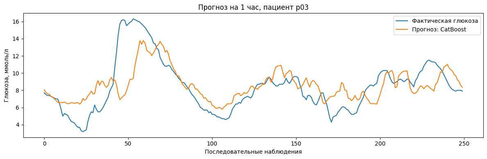

# Прогнозирование уровня глюкозы через 1 час

## Описание проекта

Проект посвящён прогнозированию уровня глюкозы в крови через один час по истории измерений пациента.

В качестве целевой переменной используется `bg+1:00` — уровень глюкозы через 60 минут. Для построения прогноза используются предыдущие значения глюкозы, данные об инсулине, углеводах, пульсе, физической активности и времени суток.

Данные взяты [BrisT1D Blood Glucose Prediction](https://www.kaggle.com/competitions/brist1d) на Kaggle.

Строки исходного train.csv представлены в хронологическом порядке отдельно для каждого участника. Файл train.csv не хранится в репозитории из-за большого размера. Его необходимо скачать с Kaggle.
## Использованные данные и признаки

В исходных данных для каждого наблюдения содержится история показателей пациента за предыдущие часы.

В проекте используются:

- прошлые значения уровня глюкозы;
- количество введённого инсулина;
- количество углеводов;
- частота сердечных сокращений;
- количество шагов;
- расход калорий;
- время суток.

Дополнительно были рассчитаны:

- среднее значение глюкозы за разные временные интервалы;
- стандартное отклонение;
- минимальное и максимальное значения;
- изменение глюкозы за 30, 60 и 120 минут;
- суммарные значения инсулина, углеводов, шагов и калорий;
- циклические признаки времени суток.

## Разделение данных

Разделение выполнялось отдельно для каждого пациента с сохранением временного порядка:

- первые 80% наблюдений использовались для обучения;
- последние 20% наблюдений использовались для валидации.

Такое разделение позволяет оценить качество прогноза на будущих наблюдениях и избежать перемешивания временного ряда.

## Использованные модели

### Last value

Наивная модель, которая использует последнее известное значение глюкозы как прогноз на следующий час.

### Ridge

Линейная регрессионная модель с L2-регуляризацией, обученная на лаговых и агрегированных признаках.

### HistGradientBoosting

Модель градиентного бустинга из `scikit-learn`.

### CatBoost

Градиентный бустинг по деревьям решений, использующий лаговые значения и дополнительные признаки.

### Hybrid GRU

Гибридная нейронная сеть, состоящая из двух частей:

- GRU обрабатывает многомерную последовательность значений глюкозы, инсулина, углеводов, пульса, шагов и калорий;
- полносвязная ветка обрабатывает агрегированные признаки и время суток.

Полученные представления объединяются и используются для прогноза уровня глюкозы через один час.

## Результаты

| Модель | RMSE | MAE |
|---|---:|---:|
| CatBoost | 1.970 | 1.463 |
| HistGradientBoosting | 1.989 | 1.473 |
| Hybrid GRU | 1.992 | 1.484 |
| Ridge | 2.116 | 1.588 |
| Last value | 2.435 | 1.790 |

Лучшее качество среди обученных моделей показал `CatBoost`: `RMSE = 1.970` и `MAE = 1.463`.

На графике представлены фактические и спрогнозированные значения уровня глюкозы на последовательном фрагменте валидационной выборки.

